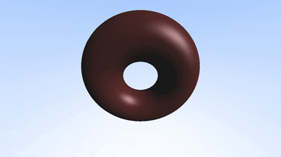

# CPU Raymarcher

A Raymarcher I wrote following a blend of several tutorials (below) and my own work. It runs on the cpu so it's quite slow.

https://raytracing.github.io/books/RayTracingInOneWeekend.html#overview

http://jamie-wong.com/2016/07/15/ray-marching-signed-distance-functions/

https://iquilezles.org/articles/distfunctions/

# Building

Clone the repo and run `make` in the `src` folder to get the executable, `./main`. Running `./main` will output `.ppm ` files in the `../output/` directory, which can be assembled into a video via your own methods or via the `./render.sh` script (requires ffmpeg).

# Examples

GIF Preview (click for high resolution mp4)

